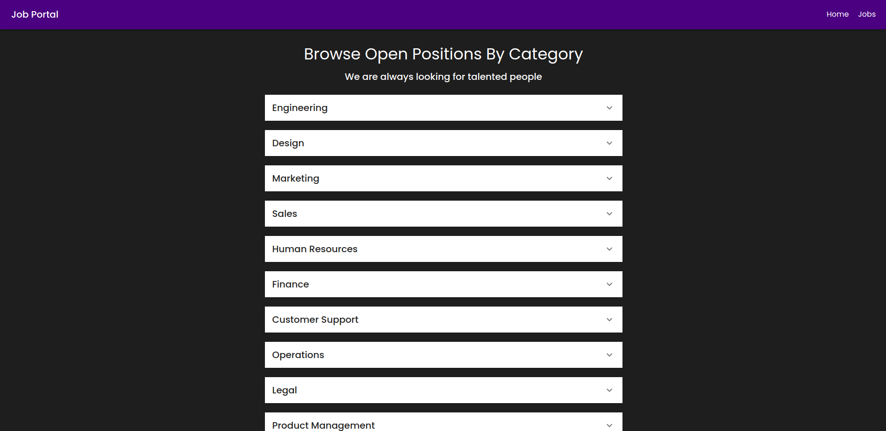

<h1 class="code-line" data-line-start=0 data-line-end=1 >Job Portal</h1>

<h2 class="code-line" data-line-start=4 data-line-end=5 >Description</h2>

This project is a job portal application built using React.js and Material UI. It allows users to create, view, edit, and remove job posts using API endpoints with JWT authentication.

<h2 class="code-line" data-line-start=8 data-line-end=9 >Getting Started</h2>
<h3 class="code-line" data-line-start=10 data-line-end=11 >Dependencies</h3>
<ul>
<li class="has-line-data" data-line-start="12" data-line-end="13">Node.js</li>
<li class="has-line-data" data-line-start="13" data-line-end="14">React Router v6</li>
<li class="has-line-data" data-line-start="14" data-line-end="15">Material UI</li>
<li class="has-line-data" data-line-start="15" data-line-end="16">Axios for API calls</li>
<li class="has-line-data" data-line-start="16" data-line-end="18">JWT for authentication</li>
</ul>
<h3 class="code-line" data-line-start=18 data-line-end=19 >Installing</h3>
<ol>
<li class="has-line-data" data-line-start="20" data-line-end="24">Clone the repository:<pre><code class="has-line-data" data-line-start="22" data-line-end="24" class="language-bash">https://github.com/faysalewucse/job_portal_techforing_task.git
cd job-portal
</code></pre>
</li>
<li class="has-line-data" data-line-start="24" data-line-end="27">Install dependencies:<pre><code class="has-line-data" data-line-start="26" data-line-end="27" class="language-bash">npm install
</code></pre>
</li>
<li class="has-line-data" data-line-start="27" data-line-end="30">Create a .env.local file in the root directory and add the following content:<pre><code class="has-line-data" data-line-start="29" data-line-end="30" class="language-bash">VITE_API_BASE_URL=https://job-portal-server-5gl2.onrender.com/api/v1
</code></pre>
</li>
<li class="has-line-data" data-line-start="30" data-line-end="31">Save the file.</li>
<li class="has-line-data" data-line-start="31" data-line-end="34">Start the development server:<pre><code class="has-line-data" data-line-start="33" data-line-end="34" class="language-bash">npm run dev
</code></pre>
</li>
<li class="has-line-data" data-line-start="34" data-line-end="36">Open your browser and navigate to <a href="http://localhost:6001">http://localhost:6001</a>.</li>
</ol>
<h2 class="code-line" data-line-start=36 data-line-end=37 >Job Portal API Documentation</h2>

This document provides a comprehensive overview of the API endpoints for the job portal application.

<strong>Authors:</strong>

<ul>
<li class="has-line-data" data-line-start="41" data-line-end="43">Faysal Ahmed (GitHub: <a href="https://github.com/faysalewucse">faysalewucse</a>)</li>
</ul>

<strong>Version History:</strong>

<ul>
<li class="has-line-data" data-line-start="44" data-line-end="46">1.0 - Initial Release (Current Version)</li>
</ul>
<h2 class="code-line" data-line-start=46 data-line-end=47 >User Authentication</h2>

Before accessing job-related functionalities, users need to register and log in to the system.

<ul>
<li class="has-line-data" data-line-start="50" data-line-end="54"><strong>POST /api/users/signup</strong>
<ul>
<li class="has-line-data" data-line-start="51" data-line-end="52">Creates a new user account.</li>
<li class="has-line-data" data-line-start="52" data-line-end="53"><strong>Request Body:</strong> Details for the new user (e.g., username, password, email).</li>
<li class="has-line-data" data-line-start="53" data-line-end="54"><strong>Response:</strong> User object containing relevant information (e.g., ID, username) upon successful registration. Error message if registration fails.</li>
</ul>
</li>
<li class="has-line-data" data-line-start="54" data-line-end="59"><strong>POST /api/users/signin</strong>
<ul>
<li class="has-line-data" data-line-start="55" data-line-end="56">Authenticates an existing user.</li>
<li class="has-line-data" data-line-start="56" data-line-end="57"><strong>Request Body:</strong> User credentials (username/email and password).</li>
<li class="has-line-data" data-line-start="57" data-line-end="59"><strong>Response:</strong> Authentication token upon successful login. Error message if login fails.</li>
</ul>
</li>
</ul>
<h2 class="code-line" data-line-start=59 data-line-end=60 >Job Management</h2>

These endpoints allow users to create, view, edit, and delete job posts.

<ul>
<li class="has-line-data" data-line-start="63" data-line-end="67"><strong>POST /api/v1/jobs</strong>
<ul>
<li class="has-line-data" data-line-start="64" data-line-end="65">Creates a new job post.</li>
<li class="has-line-data" data-line-start="65" data-line-end="66"><strong>Request Body:</strong> Details of the job post (e.g., title, description, company, category, etc.). Requires authentication.</li>
<li class="has-line-data" data-line-start="66" data-line-end="67"><strong>Response:</strong> Newly created job post object upon success. Error message if job creation fails.</li>
</ul>
</li>
<li class="has-line-data" data-line-start="67" data-line-end="70"><strong>GET /api/v1/jobs</strong>
<ul>
<li class="has-line-data" data-line-start="68" data-line-end="69">Retrieves all existing job posts. May require authentication depending on implementation.</li>
<li class="has-line-data" data-line-start="69" data-line-end="70"><strong>Response:</strong> Array of job post objects containing details of each job.</li>
</ul>
</li>
<li class="has-line-data" data-line-start="70" data-line-end="74"><strong>PUT /api/v1/jobs/:id</strong>
<ul>
<li class="has-line-data" data-line-start="71" data-line-end="72">Updates an existing job post.</li>
<li class="has-line-data" data-line-start="72" data-line-end="73"><strong>Request Body:</strong> Modified details for the job post. Requires authentication and authorization to edit the specific job.</li>
<li class="has-line-data" data-line-start="73" data-line-end="74"><strong>Response:</strong> Updated job post object upon success. Error message if update fails.</li>
</ul>
</li>
<li class="has-line-data" data-line-start="74" data-line-end="78"><strong>DELETE /api/v1/jobs/:id</strong>
<ul>
<li class="has-line-data" data-line-start="75" data-line-end="76">Deletes an existing job post.</li>
<li class="has-line-data" data-line-start="76" data-line-end="78"><strong>Response:</strong> Message indicating success or failure of deletion. Requires authentication and authorization to delete the specific job.</li>
</ul>
</li>
</ul>

<strong>Note:</strong>

<ul>
<li class="has-line-data" data-line-start="80" data-line-end="82">The <code>:id</code> placeholder in the <code>PUT</code> and <code>DELETE</code> endpoints represents the unique identifier of the job post you want to edit or delete.</li>
</ul>

This documentation provides a basic overview of the API endpoints.

